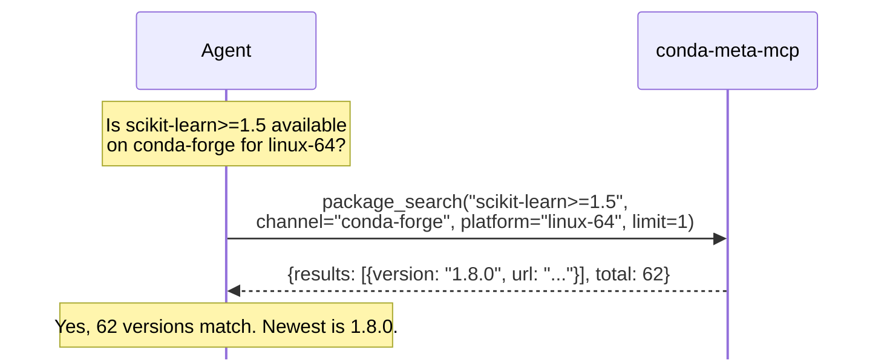
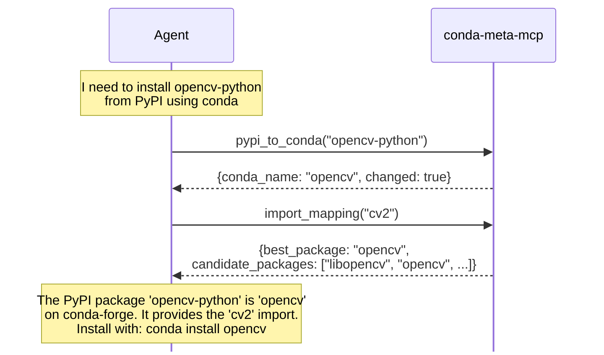
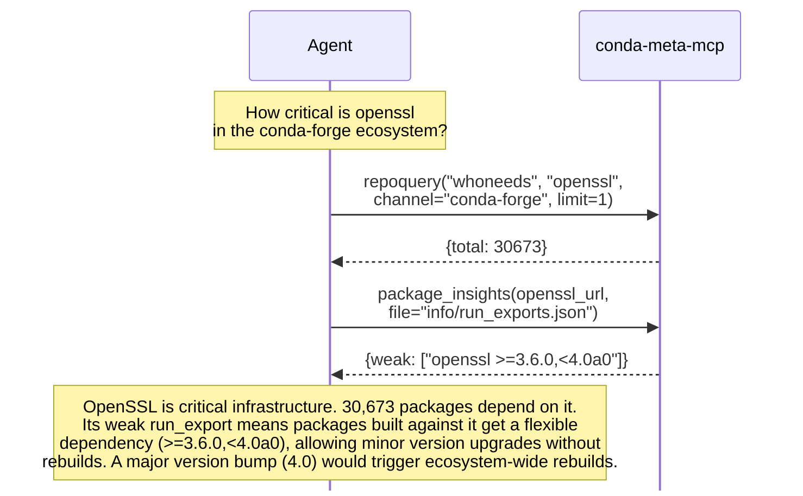
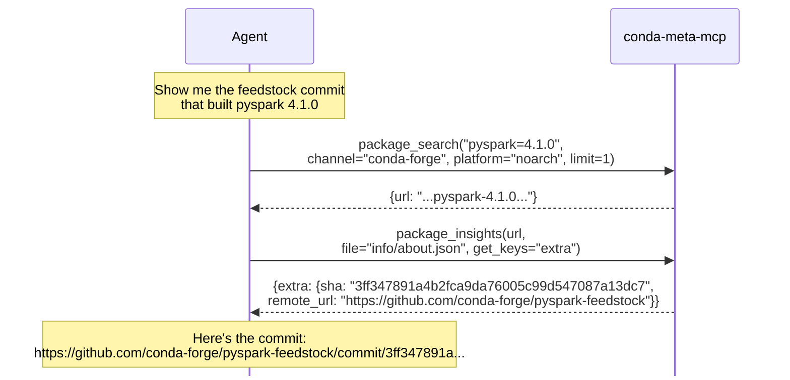
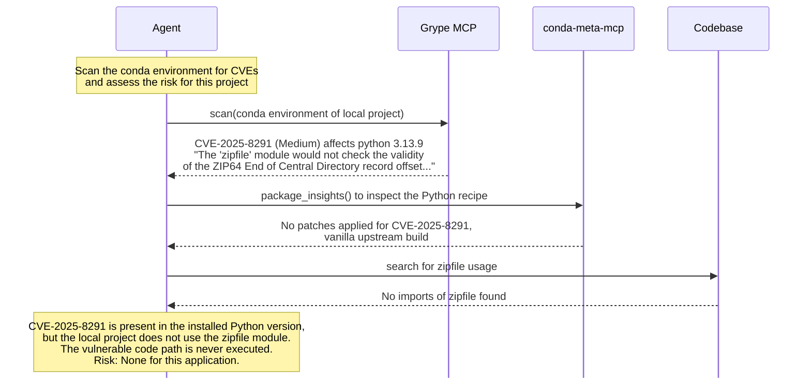

Modern AI agents like Claude, Cursor, OpenCode, and Zed can fetch web content, run shell commands, and even install packages. But they lack direct access to the rich, structured metadata embedded in conda packages. This information is essential for solving complex packaging problems. **conda-meta-mcp** provides that missing link.

<!-- truncate -->

*AI agents reason well, but only with good data. conda-meta-mcp bridges the gap between frozen training data and live ecosystem metadata.*

This article introduces [conda-meta-mcp](https://github.com/conda-incubator/conda-meta-mcp), an MCP server that exposes authoritative, read-only conda ecosystem metadata directly to AI agents. We'll explore the problem it solves, the tools it provides, and real-world workflows that demonstrate its power.

## The Problem: Knowledge Cutoffs Meet Rich Metadata

When you ask an AI agent about conda, you hit two walls:

**Knowledge cutoffs.** Models trained in mid-2024 know nothing about September releases, new conda features, or recent CVEs. They guess based on stale training data.

**Inaccessible metadata.** Even with web access, agents can't efficiently query the structured data embedded in conda packages: recipes, dependency graphs, run_exports, build provenance. This information is buried in package archives, not exposed through simple web APIs.

Consider these questions:

- "Is `scikit-learn>=1.5` available on conda-forge for linux-64?"
- "What packages depend on numpy in conda-forge?"
- "Which conda package provides the `cv2` Python import?"
- "What run_exports does openssl declare?"
- "Which package ships `libcuda.so`?"
- "Which feedstock commit bumped pyspark to version v4.1.0?"

These aren't reasoning failures. They're **data access problems**. AI agents reason well with good information. Without **live, authoritative metadata**, they can't solve real packaging problems reliably.

## Enter conda-meta-mcp

[**conda-meta-mcp**](https://github.com/conda-incubator/conda-meta-mcp) is an **MCP (Model Context Protocol) server** that exposes authoritative, read-only conda ecosystem metadata directly to AI agents. The project is currently in incubation within the conda-incubator GitHub organization.

:::tip[What is MCP?]
The **[Model Context Protocol](https://modelcontextprotocol.io/)** is an open standard (introduced by Anthropic in 2024) for connecting AI models and agents to external data sources and tools. MCP servers can expose three types of primitives: **tools** (executable functions), **resources** (contextual data), and **prompts** (interaction templates). Agents invoke tools based on their descriptions, effectively a form of prompt injection that guides agent behavior.

Key benefit: agents query live data without embedding it in their training.
:::

Instead of relying on stale training data, agents can now call structured tools:



The user doesn't need to know how to call MCP tools or when to use them. **The LLM selects appropriate tools based on their descriptions** and synthesizes results into human-readable answers.


## Why Conda Metadata Is Uniquely Rich

Every conda package embeds an `info/` metadata tarball containing:

- **Recipe and build scripts** (`meta.yaml`/`recipe.yaml`, `build.sh`, `bld.bat`): source provenance, dependency declarations, build commands
- **Rendered metadata** (`run_exports.json`, `index.json`, `about.json`): resolved constraints, feedstock URL and commit SHA, CI job identifiers

This is far richer than what wheels or sdists provide. The embedded provenance enables **auditable reproducibility**: you can rebuild a binary from first principles using metadata stored in the package.

This same metadata powers conda-forge's migration infrastructure, the heavy machinery that builds dependency graphs and continuously rebuilds thousands of packages (as described in [Part 3 of our conda series](./2025-11-11-conda-practical-power.mdx)).

:::note
Most conda-meta-mcp tools query indexed extracts of this embedded metadata: repodata indexes package specs, conda-forge indexes import mappings and PyPI names, and Quansight's API indexes file paths.
:::


## The Tools

conda-meta-mcp exposes ecosystem knowledge through **seven composable tools**. Agents chain them to answer complex questions.

These tools fall into two categories: **package discovery** (finding and inspecting packages) and **ecosystem navigation** (understanding relationships and mappings). All tools are read-only and designed for efficient context usage.

### Package Discovery

#### `package_search`: Find Packages by Spec

Search packages by spec, channel, and platform. Results ordered by newest version.

```python
>>> package_search("scipy", channel="conda-forge", platform="linux-64", limit=1)
{"results": [{"version": "1.16.3", "url": "...scipy-1.16.3-py314hf5b80f4_1.conda"}], "total": 472}
```

#### `package_insights`: Deep Package Inspection

Inspect a package's `info/` tarball: rendered recipe, run_exports, source provenance. Foundation for **SBOM generation** and **CVE analysis**.

```python
>>> package_insights(url="...openssl-3.6.0-h26f9b46_0.conda", file="info/run_exports.json")
{"info/run_exports.json": {"weak": ["openssl >=3.6.0,<4.0a0"]}}
```

### Ecosystem Navigation

These tools help agents understand relationships between packages, map across ecosystems, and navigate the dependency graph.

#### `repoquery`: Dependency Graph Navigation

Query what depends on a package (`whoneeds`) or what a package depends on (`depends`).

```python
>>> repoquery("whoneeds", "numpy", channel="conda-forge", limit=1)
{"query": {"total": 286778}, ...}
```

#### `cli_help`: Conda CLI Documentation

Introspect conda's command-line interface dynamically. Supports regex filtering.

```python
>>> cli_help(tool="conda", grep="create", limit=10)
"conda create: Create a new conda environment from a list of specified packages..."
```

#### `import_mapping`: Python Import to Package

Map Python imports to conda packages. Essential for **cross-ecosystem discovery**.

```python
>>> import_mapping("cv2")
{"best_package": "opencv", "candidate_packages": ["libopencv", "opencv", "opencv-python-headless"]}
```

#### `pypi_to_conda`: PyPI Name to Conda Package

Map PyPI distribution names to conda equivalents. Handles the **naming convention differences** between ecosystems.

```python
>>> pypi_to_conda("PyYAML")
{"pypi_name": "PyYAML", "conda_name": "pyyaml", "changed": false}
```

#### `file_path_search`: Find Packages by File Path

Search for packages containing a specific file path. Useful for finding which package provides a specific binary or library.

```python
>>> file_path_search("bin/conda", limit=5)
{"artifacts": ["cf/linux-64/conda-4.6.9-py36_0", ...], "total": 1000}
```

All tools support `limit` and `offset` for pagination. Most support `get_keys` for field filtering to protect agent context windows.


## Real-World Workflows

### Cross-Ecosystem Package Discovery

PyPI and conda use different naming conventions. An agent can resolve these mappings:



### Understanding Ecosystem Impact



### Reviewing Dependency Updates

When Renovate proposes a version bump, you want to know what actually changed beyond the version number. Did the maintainers add patches? Change dependencies? Modify build scripts?



The URL allows a user or agent to inspect in detail what was changed by whom.

### CVE Analysis with Grype MCP

Regulations like NIS2, DORA, and the Cyber Resiliency Act require organizations to track their software supply chain. The [Grype MCP](https://github.com/anchore/grype-mcp) can scan conda environments for CVEs. When combined with conda-meta-mcp, agents can perform deeper analysis to determine if a CVE actually affects your code.

Here's a concrete example: an agent scans its own MCP server environment:



This deep analysis is only possible by combining multiple tools: Grype for CVE detection, conda-meta-mcp for package inspection, and code search for call graph analysis. A CVE scanner alone would flag the vulnerability without this context.

See also [QuantCo's blog on conda regulation support](https://tech.quantco.com/blog/conda-regulation-support) for how `syft` consumes `conda-meta/` files to generate SBOMs that standard CVE scanners can process.


## Engineering: Built on Battle-Tested Foundations

conda-meta-mcp wraps existing, proven conda ecosystem libraries with no wheel reinvention:

- `conda_package_streaming.url.stream_conda_info()`: Streams metadata from CDN (~100ms, no full download)
- `conda.api.SubdirData.query_all()`: Queries repodata.json using SAT solvers
- `conda.cli.conda_argparse.generate_parser()`: Exposes conda's CLI documentation dynamically
- `conda_forge_metadata`: Provides PyPI to conda and import to package mappings
- `libmambapy`: Powers repoquery with fast dependency graph traversal
- `conda-forge-paths database`: Powers file path search via Quansight's API

**Built with [FastMCP](https://github.com/jlowin/fastmcp)** for minimal boilerplate and async support.

**Managed with [pixi](https://pixi.sh/)** for fast, reproducible environments with lockfiles.

### Design Principles

1. **Read-only by contract**: Never mutates environments. Safe to host publicly.
2. **Context-aware**: Pagination, filtering, and windowing protect agent context.
3. **Fast startup**: pixi's lockfile ensures reproducible, secure dependency fetch in seconds.


## Getting Started

See the [conda-meta-mcp README](https://github.com/conda-incubator/conda-meta-mcp#readme) for installation instructions covering Claude Desktop, Cursor, OpenCode, Zed, VSCode, and GitHub Copilot.

:::info[Composability]
conda-meta-mcp can be combined with other MCP servers for cross-ecosystem queries. The MCP protocol enables this composability by design.
:::


## Outlook

conda-meta-mcp is **use case agnostic**: it exposes ecosystem facts without judgment, and works with many AI agents. What will you build? CVE analysis, dependency audits, migration planning, compliance reporting? The examples in this post are starting points.

**Share your prompts and use cases with the project:**

- [conda-meta-mcp on GitHub](https://github.com/conda-incubator/conda-meta-mcp)
- Open an issue or discussion with your discoveries

Happy experimenting!

:::warning[Disclaimer]
conda-meta-mcp provides data from upstream APIs without warranty of accuracy or completeness. We make no guarantees about LLM interpretation or actions based on this data. Third-party MCP servers (such as Grype MCP) are not provided, verified, or supported by us. Don't trust, verify!
:::


## Further Reading

- [Model Context Protocol specification](https://modelcontextprotocol.io/)
- [Conda Ecosystem Explained](./2024-08-14-conda-ecosystem-explained.mdx)
- [Practical Power: Reproducibility, Automation, and Layering](./2025-11-11-conda-practical-power.mdx)
