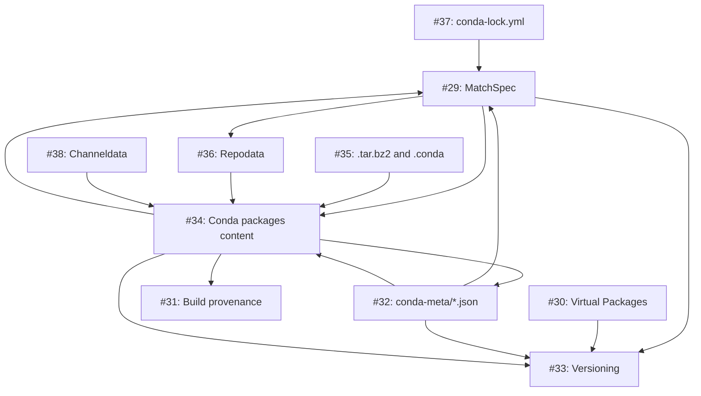

Over the last few months, the conda steering council has spent significant resources into reducing the standardization debt in the conda ecosystem. This effort culminated in the approval of 10 new CEPs covering the foundational pillars of conda. This is a turning point in our community that is worth celebrating with a blog post!

<!-- truncate -->

## De facto standards

The conda ecosystem is mostly founded upon the tooling initially built by Anaconda. As the sole vendor, many aspects of the conda "standards" did not go through a process of design and standardization in the open; instead, they were probably deliberated internally by the responsible teams at the time. Excerpts of those decisions are sometimes captured in Github issues or pull requests, but not always.

As a result, the body of standards for the conda ecosystem has been dictated by the implementations found in `conda/conda` and `conda/conda-build`, among others. Reimplementations like `mamba` or `rattler` only had two things to guide their process: the source code and the behaviour of the existing tools. However, it was never clear which parts of the implementation were intentional or accidental (bug or feature?), leading to some ambiguity in their interpretation that in turn created an opportunity for drift.

That's why the conda community decided to implement an Enhancement Proposal system modeled after Python or Jupyter's process: CEPs (Conda Enhancement Proposals). This created the scaffolding needed to discuss and decide on policies and standards that affect the whole community. The CEPs system was successfully used by the community to innovate and address some design limitations of the original standards. In the last few years, we have seen new recipe formats and repodata distribution strategies. Unfortunately, the lack of formal standards meant that these innovative CEPs had to leave many details out of the document. For a person outside of the ecosystem, a sentence like "this field can take one or more MatchSpec strings" meant probably nothing. "What is a MatchSpec?" would be the only natural response... and we had no formal document for that!

## Pay down the debt

The only logical way to proceed was to roll up our sleeves and fill in the missing details, from the beginning. We took a look at how other ecosystems had addressed this issue and adopted many of their practices. The [Open Container Initiative (OCI)](https://opencontainers.org) specs and [PyPA specifications](https://packaging.python.org/en/latest/specifications/) were instrumental in this stage.

The first CEP we wrote (and approved!) in this direction was [CEP 26](https://github.com/conda/ceps/blob/main/cep-0026.md), where we discussed what valid identifiers for packages and channels look like. This was the first time that the community was explicitly saying that unicode characters are not allowed in conda package names. Yes, `conda-build` [would happily build](https://github.com/conda/conda-build/blob/2ec652f69c94a0ec5f339c221c1cff54218e2c7c/tests/test-recipes/metadata/unicode_all_over/love-feedstock/meta.yaml#L1) `❤️-1.0-0.tar.bz2` for you.

Writing that CEP we realized we had to leave many details out. We only went so far as to say which characters are allowed in a version string, but not how these are structured. We knew that opening that can of worms was a free ticket for quite the rabbit hole. But the only way is through, so there we went, and this is what happened:

After several months of writing and discussions, we [started](https://github.com/conda/ceps/issues/147) the final RFC (Request For Comments) period on January 28th. Two weeks later, on February 16th, we [opened](https://github.com/conda/ceps/issues/147#issuecomment-3908100064) the voting period for two more weeks. The votes were counted on March 3rd, with the following results:

| CEP                                                                                             | Votes | Yes | No | Abstain | Passed? | Minted as |
|-------------------------------------------------------------------------------------------------|:-----:|:---:|:--:|:-------:|:-------:|:---------:|
| [#82: MatchSpec](https://github.com/conda/ceps/pull/82#issuecomment-3908064782)                      | 13    | 13  | 0  | 0       | ✅      |        29 |
| [#103: Virtual packages](https://github.com/conda/ceps/pull/103#issuecomment-3908069079)              | 14    | 14  | 0  | 0       | ✅      |        30 |
| [#113: Build provenance](https://github.com/conda/ceps/pull/113#issuecomment-3908070984)              | 11    | 11  | 0  | 0       | ✅      |        31 |
| [#124: Structure of conda envs](https://github.com/conda/ceps/pull/124#issuecomment-3908072251)       | 11    | 11  | 0  | 0       | ✅      |        32 |
| [#132: Versions](https://github.com/conda/ceps/pull/132#issuecomment-3908074012)                      | 11    | 11  | 0  | 0       | ✅      |        33 |
| [#133: Contents of packages](https://github.com/conda/ceps/pull/133#issuecomment-3908077317)          | 11    | 11  | 0  | 0       | ✅      |        34 |
| [#134: Package file formats](https://github.com/conda/ceps/pull/134#issuecomment-3908078822)          | 11    | 11  | 0  | 0       | ✅      |        35 |
| [#135: Repodata](https://github.com/conda/ceps/pull/135#issuecomment-3908081288)                      | 12    | 12  | 0  | 0       | ✅      |        36 |
| [#138: conda-lock.yml](https://github.com/conda/ceps/pull/138#issuecomment-3908083860)                | 13    | 12  | 0  | 1       | ✅      |        37 |
| [#140: Channeldata](https://github.com/conda/ceps/pull/140#issuecomment-3908085930)                   | 12    | 12  | 0  | 0       | ✅      |        38 |

## What's next

The CEP numbers are somewhat arbitrary and don't necessarily allow for a structured reading of the specifications. Following PyPA's example, we will organize their content in the [Learn> Specifications](/learn/specifications.md) part of this website, trimmed to just the specification bits and leaving other details like rationale and motivation out. The idea is to have a single place where newcomers can quickly learn details what a valid package name is without having to parse through all the existing CEPs. This section will also aggregate the result of newer CEPs should they supersede or extend the existing ones.

Most of the CEPs we passed simply codify what `conda` had already been doing for years. While this provides a much needed baseline, some of those legacy behaviors aren't necessarily ideal. In the future, we plan to refine these standards and deprecate outdated behaviors to keep the ecosystem lean.

But that is a goal for the next round. For now, let’s celebrate this milestone. A huge thank you to the steering council and everyone who contributed to the discussions!

---

Photo by <a href="https://unsplash.com/@alex_skobe?utm_source=unsplash&utm_medium=referral&utm_content=creditCopyText">Alex Skobe</a> on <a href="https://unsplash.com/photos/a-single-mushroom-growing-on-mossy-ground-sQwqZO9qsso?utm_source=unsplash&utm_medium=referral&utm_content=creditCopyText">Unsplash</a>

