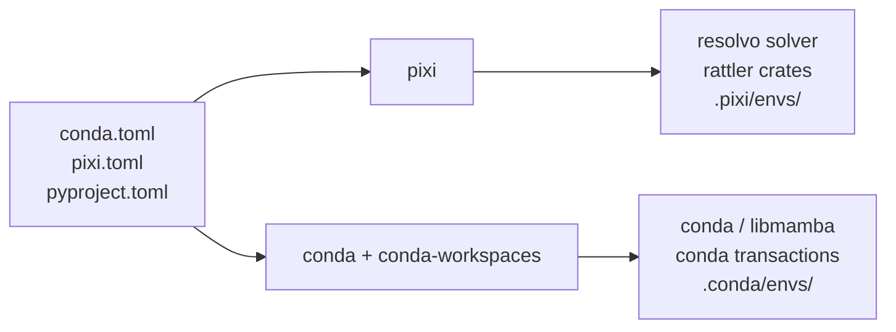

import Tabs from '@theme/Tabs';
import TabItem from '@theme/TabItem';

Earlier this month, Dan Yeaw described his vision for a better conda CLI in [Building a Better conda CLI: A Vision](/blog/2026-04-17-vision-for-conda-cli): declarative project environments via `conda.toml`, a workspace-aware CLI, and reproducible cross-platform locks shipped as part of conda itself. [conda-workspaces 0.4.0](https://github.com/conda-incubator/conda-workspaces) ships today as a concrete step in that direction.

The workspace model itself comes from [pixi](https://pixi.sh) by [prefix.dev](https://prefix.dev), where one TOML manifest declares a project's environments, features, platforms, and tasks. conda-workspaces is a conda plugin that brings that model to conda: it reads the same `conda.toml`, `pixi.toml`, or `pyproject.toml` manifest, materializes each declared environment as an ordinary conda prefix under `.conda/envs/`, and runs the declared tasks through the conda CLI. Nothing underneath is replaced: the same solver, package cache, channel authentication, and `condarc` that any other conda command uses keep doing the work.

<!-- truncate -->

## “Isn’t that what pixi is for?”

It is the first thing every reviewer asks.

pixi is its own complete stack: the workspace manifest, plus a Rust runtime ([resolvo](https://github.com/prefix-dev/resolvo) for solving and the [rattler](https://github.com/conda/rattler) crates for conda primitives) distributed as a single binary. conda-workspaces reuses the manifest part and runs it through conda's stack instead. Both tools read the same `conda.toml` / `pixi.toml` / `pyproject.toml` and turn the declared environments into conda prefixes.

The difference is what sits underneath. conda-workspaces uses conda for everything below the manifest: conda's solver, conda's package cache, conda's transaction code, and whatever channel and authentication setup is already in `condarc`. Environments land under `.conda/envs/` as ordinary conda prefixes. `conda activate .conda/envs/test` works. `conda list` works. Both tools can sit on the same `pixi.toml` and see the same dependencies, environments, and tasks. Each writes to its own subdirectory (`.pixi/envs/` for pixi, `.conda/envs/` for conda-workspaces), so the two tools never collide on disk.



:::tip[Definition]
A workspace is a directory containing a manifest (`conda.toml`, `pixi.toml`, or `pyproject.toml`) that declares one or more named environments, optional reusable features (groups of dependencies, channels, or activation scripts), the platforms the workspace targets, and optional tasks that run inside those environments. Installing the workspace materializes each environment as a project-local conda prefix under `.conda/envs/<name>/`.
:::

## What it looks like

A `conda.toml` in the project root:

```toml
[workspace]
name = "my-project"
channels = ["conda-forge"]
platforms = ["linux-64", "osx-arm64", "win-64"]

[dependencies]
python = ">=3.10"
numpy = ">=1.24"

[feature.test.dependencies]
pytest = ">=8.0"
pytest-cov = ">=4.0"

[environments]
default = []
test = { features = ["test"] }

[tasks]
lint = "ruff check ."
test = { cmd = "pytest tests/ -v" }

[tasks.check]
depends-on = ["test", "lint"]
```

Then drive it from the conda CLI:

```bash
conda workspace install         # solve + install all envs + write conda.lock
conda workspace envs            # list the environments it built
conda task run check            # runs lint and test in dependency order
conda workspace shell -e test   # spawn a shell with the test env activated
conda workspace install --locked  # reproducible install from conda.lock
```

For projects that would rather skip writing a manifest by hand, `conda workspace quickstart` composes init, add, install, and shell into a single command. From an empty directory to an installed environment with an activated shell, in one step:

```bash
conda workspace quickstart python=3.14 numpy
```

`--no-shell` makes it CI-friendly, and `--json` returns a scriptable summary. See [Your first workspace](https://conda-incubator.github.io/conda-workspaces/quickstart/#your-first-workspace) for the full walkthrough.


## Why this exists

The conda ecosystem has tried to solve this before.

[anaconda-project](https://github.com/anaconda/anaconda-project) was the first tool to attach project-scoped conda environments to a manifest, with command runners, downloads, and platform variants baked in. [conda-project](https://github.com/conda-incubator/conda-project) is its community successor, layering [conda-lock](https://github.com/conda/conda-lock) on top for reproducibility. [conda-devenv](https://github.com/ESSS/conda-devenv) takes a different angle: Jinja2 over `environment.yml` for composition and inheritance. Each of these still has a healthy user base and solves the problem its constituency cares about. What none of them share is a manifest format with each other, or with anything outside the conda ecosystem.

pixi reframed what a TOML workspace manifest could look like (composable features, named environments, platform targeting, a built-in task runner), and that schema is what conda-workspaces uses. The manifest itself is, by design, identical between the two tools.

What conda-workspaces adds is a way to drive that same manifest from inside a conda installation. Solving uses conda or libmamba (or [conda-rattler-solver](https://github.com/conda-incubator/conda-rattler-solver) when installed). Installation uses conda's transaction code. PyPI dependencies, when present, are handled by [conda-pypi](https://github.com/conda/conda-pypi). Lockfile reading and writing route through [conda-lockfiles](https://github.com/conda-incubator/conda-lockfiles). A workspace ends up looking, on disk, exactly like a directory full of conda environments.

That makes the two tools comfortably complementary. Teams that prefer pixi's batteries-included Rust experience keep using pixi. Teams that already live in the conda ecosystem (with their own channels, mirrors, authentication, and `condarc`) get the same workspace ergonomics without swapping out the rest of the stack. The same `pixi.toml` can live in a shared repo and serve both groups.

:::info[Where this is going]
The longer-term direction sketched in the [Vision](/blog/2026-04-17-vision-for-conda-cli) post is for the workspace model (`conda.toml` as the project format, workspaces as a first-class CLI concept, `conda.lock` as a community-owned lockfile) to ship as part of a future conda release. conda-workspaces is the working prototype of that direction. Today it is a plugin install. The goal is that nothing about how an individual workspace is shaped has to change on the day that integration moves upstream.
:::

## What it does

### One-command bootstrap

`conda workspace quickstart` (shown above) takes a project from "no manifest" to "installed environment" in one step: it picks a manifest format, drops a sensible starting `conda.toml` (or `pixi.toml`, or `[tool.conda.workspace]` in `pyproject.toml`), solves, installs, and writes `conda.lock`. `--copy <path>` clones an existing workspace's manifest instead of running init, which is the fastest way to spin up a sister project from a known-good template.

Day-to-day edits go through `conda workspace add` and `conda workspace remove`, which by default install into the affected environments and refresh `conda.lock` in one step. `--no-install` and `--no-lockfile-update` opt back into manifest-only changes, and `--dry-run` solves without touching disk. The full flow is documented under [Add and remove dependencies](https://conda-incubator.github.io/conda-workspaces/quickstart/#add-and-remove-dependencies).

### Multi-environment workspaces with composable features

A feature is a reusable group of dependencies, channels, activation scripts, or environment variables. Environments compose features:

```toml
[feature.test.dependencies]
pytest = ">=8.0"
pytest-cov = ">=4.0"

[feature.docs.dependencies]
sphinx = ">=7.0"
myst-parser = ">=3.0"

[environments]
default = []
test = { features = ["test"] }
docs = { features = ["docs"] }
ci   = { features = ["test", "docs"] }
```

Each named environment is solved independently and installed under `.conda/envs/<name>/`. Cloning a repo is then all it takes to recreate every environment a project needs. See [Environments](https://conda-incubator.github.io/conda-workspaces/features/#environments) for the full model.

### PyPI dependencies in the same solve

PyPI packages live in their own table and resolve in the same solver call as conda packages, so a workspace can mix the two without a separate `pip install` step:

```toml
[dependencies]
python = ">=3.10"
numpy = ">=1.24"

[pypi-dependencies]
my-local-pkg = { path = ".", editable = true }
some-pypi-only = ">=1.0"

[feature.test.pypi-dependencies]
pytest-benchmark = ">=4.0"
```

This path requires [conda-pypi](https://github.com/conda/conda-pypi) (which maps PyPI names to their conda equivalents and handles wheel extraction) and [conda-rattler-solver](https://github.com/conda-incubator/conda-rattler-solver) as the solver backend. Both are still under active development, so PyPI integration is the most experimental part of conda-workspaces today. The common cases work (declared specs, named PyPI packages, plus editable / git / URL specs handed off to conda-pypi's build system after the main solve), and rough edges are being filed down upstream. If conda-pypi is not installed, PyPI dependencies are skipped with a warning, so a workspace that does not declare any works on a stock conda. Full reference in [PyPI dependencies](https://conda-incubator.github.io/conda-workspaces/features/#pypi-dependencies).

### Multi-platform `conda.lock`

`conda workspace lock` writes a single `conda.lock` that covers every platform every environment declares, not just the host. One file, one commit, one source of truth for cross-platform projects.

```bash
conda workspace lock
conda workspace lock --platform linux-64
conda workspace lock --platform linux-64 --platform osx-arm64
conda workspace lock --skip-unsolvable
```

Each platform's solve runs with conda pointed at the target platform rather than the host. That single switch picks the right channel repodata to fetch and makes conda's virtual package plugins (`__linux`, `__osx`, `__win`) report the target platform too, so a `linux-64` lock generated on macOS sees the same world a `linux-64` machine would. Tighter constraints come from `CONDA_OVERRIDE_*` or the `[system-requirements]` table when cross-compiling. Unknown platform names fail fast before any solver runs, so typos like `lixux-64` get caught at parse time instead of after a 90-second metadata download.

`conda workspace info` exposes a `Known Platforms` row (and matching `known_platforms` JSON key) that surfaces the full set of platforms reachable through any feature, not just the workspace-level list. Full reference in [Platform targeting](https://conda-incubator.github.io/conda-workspaces/features/#platform-targeting).

:::note[On the lockfile format]
`conda.lock` is a derivative of `pixi.lock`, which is itself derived from [rattler-lock v6](https://github.com/conda/rattler/tree/main/crates/rattler_lock). It is not a standard yet. The plan is to take it through the [conda CEP process](https://github.com/conda/ceps) so the format becomes a community-owned spec rather than a private detail of two project tools. In the meantime, the loader composes the upstream `conda_lockfiles.rattler_lock.v6` converter via an in-memory `version: 1 -> 6` swap, so reading and writing always go through the canonical implementation.
:::

### CI-split locking with `--merge`

Solving every platform from a single CI job becomes the bottleneck as a workspace grows. The lock command is matrix-friendly: each runner emits one fragment with `--output`, and a coordinator job stitches them back together with `--merge`, with no solver runs.

```bash
# In each matrix job
conda workspace lock \
    --platform linux-64 --output conda.lock.linux-64
conda workspace lock \
    --platform osx-arm64 --output conda.lock.osx-arm64
conda workspace lock \
    --platform win-64 --output conda.lock.win-64

# On the coordinator: pure file-level merge, no solving
conda workspace lock --merge "conda.lock.*"
```

`--merge` validates schema version and per-environment channel agreement, rejects overlapping `(environment, platform)` pairs, and produces output that is byte-identical to a single-job `conda workspace lock` over the same inputs. That last part is the one that matters: the merged lockfile is indistinguishable from one produced sequentially, so caching, hashing, and "lockfile changed?" diffs all behave normally. The flag matrix is documented under [CI-split locking](https://conda-incubator.github.io/conda-workspaces/features/#ci-split-locking-with-merge), and the [CI pipeline tutorial](https://conda-incubator.github.io/conda-workspaces/tutorials/ci-pipeline/) wires the same flow into GitHub Actions end-to-end.


### Cross-format conversion

`conda workspace export` plugs into conda's `conda_environment_exporters` plugin hook. Every format reachable through `conda export`, plus anything a third-party plugin like [conda-lockfiles](https://github.com/conda-incubator/conda-lockfiles) registers, is reachable through `conda workspace export` and vice versa. conda-workspaces registers three of those exporters itself: `conda-toml`, `pixi-toml`, and `pyproject-toml`.

```bash
conda workspace export --file environment.yml
conda workspace export --format conda-toml --file conda.toml
conda workspace export --format pyproject-toml --file pyproject.toml
conda workspace export --from-lockfile --file env.conda-lock.yml
conda workspace export --from-prefix --no-builds --from-history
```

When the target file already exists, the `pyproject-toml` exporter splices the `[tool.conda]` subtree into the document and leaves the existing `[project]`, `[build-system]`, `[tool.ruff]`, `[tool.pixi]`, and friends untouched. Any stale `[tool.conda]` is replaced. Everything else survives. Full matrix in [Export](https://conda-incubator.github.io/conda-workspaces/features/#export).

The reverse direction is `conda workspace import`. It detects the source format and writes a `conda.toml` next to it:

```bash
conda workspace import environment.yml
conda workspace import anaconda-project.yml
conda workspace import conda-project.yml
conda workspace import pixi.toml --dry-run
conda workspace import pyproject.toml --output conda.toml
```

The per-tool walkthroughs in the docs cover how each source format maps onto the workspace schema, including command and feature mappings, what carries over, and what does not: [Coming from conda](https://conda-incubator.github.io/conda-workspaces/tutorials/coming-from/conda/), [Coming from conda-project](https://conda-incubator.github.io/conda-workspaces/tutorials/coming-from/conda-project/), [Coming from anaconda-project](https://conda-incubator.github.io/conda-workspaces/tutorials/coming-from/anaconda-project/), and [Coming from pixi](https://conda-incubator.github.io/conda-workspaces/tutorials/coming-from/pixi/).

### Built-in task runner

`conda task` ships in the same plugin. The design is borrowed from pixi: task dependencies with topological ordering, per-platform overrides, input/output caching, Jinja2 templates with a `conda.*` context, and named arguments with defaults.

```toml
[tasks]
lint  = "ruff check ."
build = { cmd = "python -m build", inputs = ["src/**/*.py"], outputs = ["dist/*.whl"] }
test  = { cmd = "pytest {{ test_path }} -v", depends-on = ["build"] }

[target.win-64.tasks]
clean = "rd /s /q build"

[tasks.check]
depends-on = ["test", "lint"]
```

Tasks defined in a workspace manifest run in the workspace's `default` environment, and `-e <env>` targets a different one. Tasks in a manifest with no workspace section run in whatever conda environment is active, which is useful for adopting `conda task` in a project that is not ready for a full workspace yet. Each capability has a dedicated section in the docs:

- [Task dependencies](https://conda-incubator.github.io/conda-workspaces/features/#task-dependencies)
- [Task arguments and template variables](https://conda-incubator.github.io/conda-workspaces/features/#task-arguments)
- [Task caching](https://conda-incubator.github.io/conda-workspaces/features/#task-caching)
- [Platform-specific tasks](https://conda-incubator.github.io/conda-workspaces/features/#platform-specific-tasks)

## Install and try it

conda-workspaces is a conda plugin, so a conda installation has to exist first. Installing into a conda `base` environment registers the `conda workspace` and `conda task` plugin subcommands. The standalone `cw` and `ct` shortcut commands are always installed and work without going through `conda <subcommand>` at all.

<Tabs>
  <TabItem value="conda" label="conda" default>

    ```bash
    conda install --name base --channel conda-forge conda-workspaces
    ```

  </TabItem>
  <TabItem value="mamba" label="mamba / micromamba">

    ```bash
    mamba install --name base -c conda-forge conda-workspaces
    # or:
    micromamba install --name base -c conda-forge conda-workspaces
    ```

  </TabItem>
  <TabItem value="pixi" label="pixi global">

    ```bash
    pixi global install conda-workspaces
    ```

  </TabItem>
</Tabs>

Then, in any directory:

```bash
conda workspace quickstart python numpy
```

That is it.

## What it doesn't do

A few things to set expectations.

It is not a replacement for pixi. If a self-contained, batteries-included project tool with its own solver, runtime, and cache is the right fit, [pixi](https://pixi.sh) is the better answer. conda-workspaces is for teams that already live in the conda ecosystem and want pixi-style project workflows without moving everything else.

It does not change how conda is configured. Channels, authentication, mirrors, proxy settings, and `.condarc` continue to behave exactly the way they do for any other conda command. There is nothing new to teach existing tooling about.

It does not invent a new lockfile schema. `conda.lock` is intentionally compatible with the rattler-lock family so that lockfiles can be inspected, shared, and (eventually) standardized through the [CEP process](https://github.com/conda/ceps).

It does not require any of this all at once. A `conda.toml` with just a `[tasks]` table is a valid file: tasks run in whatever conda environment is currently active, and workspace features can be added later. Most projects start there.

## Get involved

conda-workspaces is a [conda-incubator](https://github.com/conda-incubator) project. Contributions, bug reports, and feature requests are welcome:

- [Documentation](https://conda-incubator.github.io/conda-workspaces/)
- [GitHub repository](https://github.com/conda-incubator/conda-workspaces)
- [Issue tracker](https://github.com/conda-incubator/conda-workspaces/issues)
- [Migration guides](https://conda-incubator.github.io/conda-workspaces/tutorials/coming-from/) for users coming from conda, conda-project, anaconda-project, or pixi

## Acknowledgements

The workspace and task design in conda-workspaces is directly inspired by the work of the [prefix.dev](https://prefix.dev) team on [pixi](https://github.com/prefix-dev/pixi). Composable features, named environments, platform targeting, task dependencies, caching, and template variables all come from their playbook. Many thanks for it, and for keeping the manifest format open enough that two tools can share it.

Thanks also to the [anaconda-project](https://github.com/anaconda/anaconda-project) and [conda-project](https://github.com/conda-incubator/conda-project) teams for laying the groundwork on project-scoped conda long before this plugin existed, and to the [conda-lock](https://github.com/conda/conda-lock) maintainers for years of work on cross-platform conda lockfiles (the idea `conda.lock` builds on, even though the on-disk format goes through rattler-lock). Finally, thanks to everyone who has filed issues, tested early releases, and pushed the design forward in the open.

## Further reading

- [conda-workspaces documentation](https://conda-incubator.github.io/conda-workspaces/)
- [conda-workspaces motivation](https://conda-incubator.github.io/conda-workspaces/motivation/) (the design rationale, in long form)
- [conda-workspaces CLI reference](https://conda-incubator.github.io/conda-workspaces/reference/cli/)
- [conda-workspaces on GitHub](https://github.com/conda-incubator/conda-workspaces)
- [Building a Better conda CLI: A Vision](/blog/2026-04-17-vision-for-conda-cli)
- [pixi workspace documentation](https://pixi.sh/latest/workspace/advanced_tasks/)
- [conda plugin documentation](https://docs.conda.io/projects/conda/en/stable/dev-guide/plugins/index.html)
